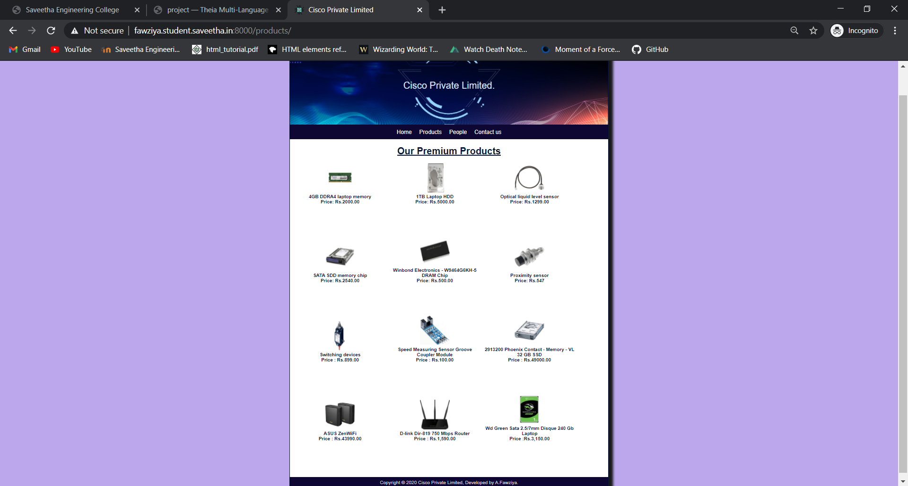

# Web Design for a Manufacturing Company
## AIM: 
To design a static website for a chip manufacturing company.

## DESIGN STEPS:
### Step 1: 
Requirement collection.
### Step 2:
Creating the layout using HTML and CSS.
### Step 3:
Updating the sample content.
### Step 4:
Choose the appropriate style and color scheme.
### Step 5:
Validate the layout in various browsers.
### Step 6:
Validate the HTML code.
### Step 6:
Publish the website in the given URL.

## PROGRAM:

### base.html
```

<!DOCTYPE html>
<html lang="en">

<head>
    <title>Cisco Private Limited</title>
    <link rel="stylesheet" href="">
    <link rel = "icon" href ="" type = "image/x-icon"> 
              
</head>

<body>
    <div class="container">
    <div class="banner">
    Cisco Private Limited.
    </div>
    <div class="menu">
        <div class="menuitem"><a href="/home">Home</a></div> 
        <div class="menuitem"><a href="/products">Products</a></div> 
        <div class="menuitem"><a href="/people">People</a></div>
        <div class="menuitem"><a href="/contactus">Contact us</a></div>
    </div><div class="content">
        
    
    </div>
    <div class="footer">
        Copyright © 2020 Cisco Private Limited, Developed by A.Fawziya.
    </div>
    </div>
</body>

</html>
```

### home.html
```



    <div class="homecontent">    
   <h1><u>About Us</u></h1>
    
    <div class="contenttext">
    Cisco Pvt Ltd, provides a broad range of semiconductor and infrastructure software applications that serve the data center, networking, software, broadband, wireless, and storage and industrial markets. Common applications for its products include: data center networking, home connectivity, broadband access, telecommunications equipment, smartphones, base stations, data center servers and storage, factory automation, power generation and alternative energy systems, displays, and mainframe operations and management, and application software development. Some of Silicon's core technologies and products include:
    <ul>
        <li>Memory Chips</li>
        <li>SATA HDD</li>
        <li>SATA SSD </li>
        <li>Broadband Modems</li>
        <li>Wifi Devices</li>
        <li>Switching Devices</li>
        <li>Optical Sensors</li>
    </ul> 
    </div>
    </div>

```

### products.html
```



    <div class="productcontent">    
    <h1 style="text-align:center;"><u>Our Premium Products</u></h1>
    <div class="productitems">
        <div class="productitem"> 
            <div class="itemimage">
            
            </div>
           <div class="itemname"><b>4GB DDRA4 laptop memory</b></div>
           <div class="itemprice"><b>Price: Rs.2000.00</b> </div>
        </div>
        <div class="productitem"> 
            <div class="itemimage">
            
            </div>
         <div class="itemname"><b>1TB Laptop HDD</b></div>
            <div class="itemprice"><b>Price: Rs.5000.00 </b></div>
        </div>
        <div class="productitem">
            <div class="itemimage">
            
            </div>
           <div class="itemname"><b>Optical liquid level sensor</b></div>
           <div class="itemprice"><b>Price: Rs.1299.00</b></div>
        </div>
        <div class="productitem">
            <div class="itemimage">
            
            </div>
          <div class="itemname"><b>SATA SDD memory chip</b></div>
          <div class="itemprice"><b>Price: Rs.2540.00</b></div>
        </div>
        <div class="productitem">
            <div class="itemimage">
            
            </div>
          <div class="itemname"><b>Winbond Electronics - W9464G6KH-5 DRAM Chip</b></div>
         <div class="itemprice"><b>Price: Rs.500.00</b></div>
        </div>
        <div class="productitem">
            <div class="itemimage">
            
            </div>
           <div class="itemname"><b>Proximity sensor</b></div>
          <div class="itemprice"><b>Price: Rs.547</b></div>
        </div>
        <div class="productitem">
            <div class="itemimage">
            
            </div>
          <div class="itemname"><b>Switching devices</b></div>
          <div class="itemprice"><b>Price : Rs.899.00</b></div>
        </div>
        <div class="productitem">
            <div class="itemimage">
            
            </div>
          <div class="itemname"><b>Speed Measuring Sensor Groove Coupler Module</b></div>
          <div class="itemprice"><b>Price : Rs.100.00</b></div>
        </div>
        <div class="productitem">
            <div class="itemimage">
            
            </div>
           <div class="itemname"><b>2913200 Phoenix Contact - Memory - VL 32 GB SSD</b> </div>
           <div class="itemprice"><b>Price : Rs.49000.00</b></div>
        </div>
        <div class="productitem">
            <div class="itemimage">
            
            </div>
          <div class="itemname"><b>ASUS ZenWiFi</b></div>
          <div class="itemprice"><b>Price : Rs.43990.00</b></div>
        </div>
        <div class="productitem">
            <div class="itemimage">
            
            </div>
           <div class="itemname"><b>D-link Dir-819 750 Mbps Router</b></div>
          <div class="itemprice"><b>Price : Rs.1,590.00</b></div>
        </div>
        <div class="productitem">
            <div class="itemimage">
            
            </div>
           <div class="itemname"><b>Wd Green Sata 2.5/7mm Disque 240 Gb Laptop</b></div>
           <div class="itemprice"><b>Price :Rs.3,150.00</b></div>
        </div>
    </div>
    </div>

```

### people.html
```



    <div class="peoplecontent">
        <h1>OUR EXECUTIVES</h1>
    </div>
    <div class="peoplelists">
        <div class="peoplelist">
            <div class="peopleimage">
                
            </div>
            <div class="peoplename"><h2>Michael Gambon</h2></div>
            <div class="peoplepost"><h3>(Founder)</h3></div>
        </div>
    
        
    </div>
    <div class="peoplelists">
        <div class="peoplelist">
            <div class="peopleimage">
                
            </div>
            <div class="peoplename"><h2>Alan Rickman</h2></div>
            <div class="peoplepost"><h3>(Chief Executive Officer)</h3></div>
        </div>
    
       
    </div>
    <div class="peoplelists">
        <div class="peoplelist">
            <div class="peopleimage">
                
            </div>
            <div class="peoplename"><h2>Daniel Radcliffe</h2></div>
            <div class="peoplepost"><h3>(Chief Operating Officer)</h3></div>
        </div>
    </div>
    
    <div class="peoplelists">
        <div class="peoplelist">
            <div class="peopleimage">
                
            </div>
            <div class="peoplename"><h2>David Thewlis</h2></div>
            <div class="peoplepost"><h3>(Chief Financial Officer)</h3></div>
        </div>
    </div>
    
    <div class="peoplelists">
        <div class="peoplelist">
            <div class="peopleimage">
                
            </div>
            <div class="peoplename"><h2>Tom Felton</h2></div>
            <div class="peoplepost"><h3>(Chief Legal Officer)</h3></div>
        </div>
    </div>
    
    <div class="peoplelists">
        <div class="peoplelist">
            <div class="peopleimage">
                
            </div>
            <div class="peoplename"><h2>Gary Oldman</h2></div>
            <div class="peoplepost"><h3>(Chief Marketing Officer)</h3></div>
        </div>
    </div>

```

### contactus.html
```



<div id="img">

</div>
    <h1 class="contactcenter">
        CONTACT
    </h1>
    <h2 class="contactcenter">
    CONTACT ADDRESS: 85 Cowcross St, Farringdon, London EC1M 6PF, United Kingdom<br>
      
    EMAIL ID:ciscocorp@gmail.com<br>
            
       CONTACT NO:9865477236
    </h2>



```

## OUTPUT:





## CODE VALIDATION REPORT:


## RESULT:
Thus a website is designed for the chip manufacturing company and is hosted in the URL http://fawziya.student.saveetha.in:8000/. HTML code is validated.